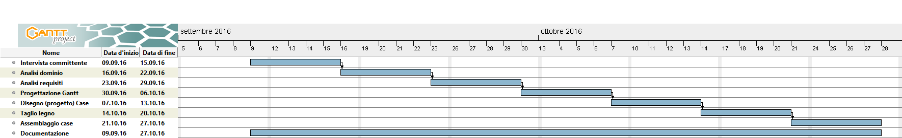

# Case Arduino

1. [Introduzione](#introduzione)

  - [Informazioni sul progetto](#informazioni-sul-progetto)

  - [Abstract](#abstract)

  - [Scopo](#scopo)

1. [Analisi](#analisi)

  - [Analisi del dominio](#analisi-del-dominio)

  - [Analisi e specifica dei requisiti](#analisi-e-specifica-dei-requisiti)

1. [Use case](#use-case)

  - [Pianificazione](#pianificazione)

  - [Analisi dei mezzi](#analisi-dei-mezzi)

1. [Progettazione](#progettazione)

  - [Design dell’architettura del sistema](#design-dell’architettura-del-sistema)

  - [Design dei dati e database](#design-dei-dati-e-database)

## Introduzione

### Informazioni sul progetto

  Progetto: Case per Arduino

  Allievo: Jonathan Fassora

  Docenti: Adriano Barchi, Luca Muggiasca

  Scuola Arti e Mestieri Trevano, Informatica, Modulo 306 + progetti

  Inizio: 09.09.2016

  Consegna: 21.10.2016

### Abstract

  E’ una breve e accurata rappresentazione dei contenuti di un documento,
  senza notazioni critiche o valutazioni. Lo scopo di un abstract efficace
  dovrebbe essere quello di far conoscere all’utente il contenuto di base
  di un documento e metterlo nella condizione di decidere se risponde ai
  suoi interessi e se è opportuno il ricorso al documento originale.

  Può contenere alcuni o tutti gli elementi seguenti:

  -   **Background/Situazione iniziale**

  -   **Descrizione del problema e motivazione**: Che problema ho cercato
      di risolvere? Questa sezione dovrebbe includere l'importanza del
      vostro lavoro, la difficoltà dell'area e l'effetto che potrebbe
      avere se portato a termine con successo.

  -   **Approccio/Metodi**: Come ho ottenuto dei progressi? Come ho
      risolto il problema (tecniche…)? Quale è stata l’entità del mio
      lavoro? Che fattori importanti controllo, ignoro o misuro?

  -   **Risultati**: Quale è la risposta? Quali sono i risultati? Quanto è
      più veloce, più sicuro, più economico o in qualche altro aspetto
      migliore di altri prodotti/soluzioni?

  Esempio di abstract:

  > *Considering the difficulties and risks in carrying the Arduino, we were requested to build a protective case for the board, while still being able to use it effectively, even when the case is closed.*

### Scopo

  Lo scopo di questo progetto è principalmente didattico, si tratta di insegnare come costruire un progetto, dalla richiesta del cliente fino alla consegna allo stesso, passando per analisi, pianificazione, documentazione, metodi di lavoro,...
  L'obiettivo invece più 'fisico' di questo lavoro è creare un case che possa proteggere l'Arduino permettendone comunque l'uso (quindi non limitandosi a una semplice scatola di legno).

## Analisi

### Analisi del dominio

  Nella situazione attuale qualunqe lavoro su Arduino viene generalmente trasportato portandosi appresso la bread board e con la scheda 'penzolante', o se proprio nella scatola del kit, sperando che non si stacchi nulla o, soprattutto, che non cada. Tramite questo piccolo progetto (e il suo 'compagno', l'holder) si vuole dunque evitare questo genere di problemi, con il case in particolare si dovrebbe riuscire a trasportare la scheda dell'Arduino in modo più sicuro, essendo comunque uno strumento piuttosto fragile.

  Esistono chiaramente prodotti affini e fabbricati con precisione assoluta, fatti apposta per ogni singolo modello. Come già detto questo progetto è a scopo didattico, dunque non è necessariamente un problema creare un prodotto che non è 'all'altezza' di ciò che si trova sul mercato, e comunque il suo lavoro lo farà lo stesso.

  In conclusione quindi si dovrebbe arrivare a un oggetto creato per scopi scolastici e che possa essere sfruttato, entro i suoi limiti, nella ambito scolastico stesso.

### Analisi e specifica dei requisiti

|ID  |REQ-001                                         |
|----|------------------------------------------------|
|**Nome**    | Realizzazione case per Arduino |
|**Priorità** | 1                     |
|**Versione** | 1.0                   |
|**Note**    |-|
|**Sub-ID**            |**Sotto requisiti** |
|**001**      | Il case dev'essere di compensato, il materiale di fissaggio è a scelta |
|**002**      | Si dovrà poter accedere a USB e alimentazione con il case chiuso    |

|ID  |REQ-002                                         |
|----|------------------------------------------------|
|**Nome**    | Fori per collegamenti ai pin |
|**Priorità** | 1                     |
|**Versione** | 1.0                   |
|**Note**    |-|
|**Sub-ID**            |**Sotto requisiti** |
|**001**      | Il case dovrà avere almeno un foro da cui possano passare i fili collegati ai vari pin quando il case è chiuso |
|**002**      | Se ci fosse la possibilità, potrà esserci un foro più ampio che permetta di collegare i suddetti fili mentre il case è chiuso |

|ID  |REQ-003                                         |
|----|------------------------------------------------|
|**Nome**    | Chiusura |
|**Priorità** | 1                     |
|**Versione** | 1.0                   |
|**Note**    |-|
|**Sub-ID**            |**Sotto requisiti** |
|**001**      | Il case dovrà essere chiuso in modo solido, il coperchio dovrà quindi fissarsi al case al momento della chiusura. |
|**002**      | A dipendenza del tipo di chiusura, il coperchio potrà essere sempre attaccato al case o meno. |

|ID  |REQ-004                                         |
|----|------------------------------------------------|
|**Nome**    | Fissaggio dell'Arduino |
|**Priorità** | 1                     |
|**Versione** | 1.0                   |
|**Note**    |-|
|**Sub-ID**            |**Sotto requisiti** |
|**001**      | L'Arduino dovrà posarsi nel case senza muoversi eccessivamente |
|**002**      | Dovrà di conseguenza essere fissato, in quanto una struttura ad incastro risulterebbe troppo complicata da realizzare |

|ID  |REQ-005                                         |
|----|------------------------------------------------|
|**Nome**    | Resistenza del case |
|**Priorità** | 1                     |
|**Versione** | 1.0                   |
|**Note**    |-|
|**Sub-ID**            |**Sotto requisiti** |
|**001**      | Il case dovrà resistere dei colpi che potrebbe ricevere in un uso comune |
|**002**      | Dovrà dunque resistere piccole cadute (1 m circa) e qualche colpo (come all'interno di uno zaino) |
|**003**      | La resistenza nel tempo è relativa alla resistenza del compensato e del materiale di fissaggio scelto |

|ID  |REQ-006                                         |
|----|------------------------------------------------|
|**Nome**    | Aerazione |
|**Priorità** | 1                     |
|**Versione** | 1.0                   |
|**Note**    |-|
|**Sub-ID**            |**Sotto requisiti** |
|**001**      | Il case dovrà avere delle uscite per il calore |

### Use case

I casi d’uso rappresentano l’interazione tra i vari attori e le
funzionalità del prodotto.

### Pianificazione

### Analisi dei mezzi

  - Compensato 4 mm
  - Nastro da hockey
  - Viti con dado
  - Gancio appendi-quadri
  - Officina
  - Colla calda
  - Cacciaviti, trapani, traforo, ...

## Progettazione

Questo capitolo descrive esaustivamente come deve essere realizzato il
prodotto fin nei suoi dettagli. Una buona progettazione permette
all’esecutore di evitare fraintendimenti e imprecisioni
nell’implementazione del prodotto.

### Design dell’architettura del sistema

Descrive:

-   La struttura del programma/sistema lo schema di rete...

-   Gli oggetti/moduli/componenti che lo compongono.

-   I flussi di informazione in ingresso ed in uscita e le
    relative elaborazioni. Può utilizzare *diagrammi di flusso dei
    dati* (DFD).

-   Eventuale sitemap

### Design dei dati e database

Descrizione delle strutture di dati utilizzate dal programma in base
agli attributi e le relazioni degli oggetti in uso.

### Schema E-R, schema logico e descrizione.

Se il diagramma E-R viene modificato, sulla doc dovrà apparire l’ultima
versione, mentre le vecchie saranno sui diari.

### Design delle interfacce

Descrizione delle interfacce interne ed esterne del sistema e
dell’interfaccia utente. La progettazione delle interfacce è basata
sulle informazioni ricavate durante la fase di analisi e realizzata
tramite mockups.

### Design procedurale

Descrive i concetti dettagliati dell’architettura/sviluppo utilizzando
ad esempio:

-   Diagrammi di flusso e Nassi.

-   Tabelle.

-   Classi e metodi.

-   Tabelle di routing

-   Diritti di accesso a condivisioni …

Questi documenti permetteranno di rappresentare i dettagli procedurali
per la realizzazione del prodotto.
